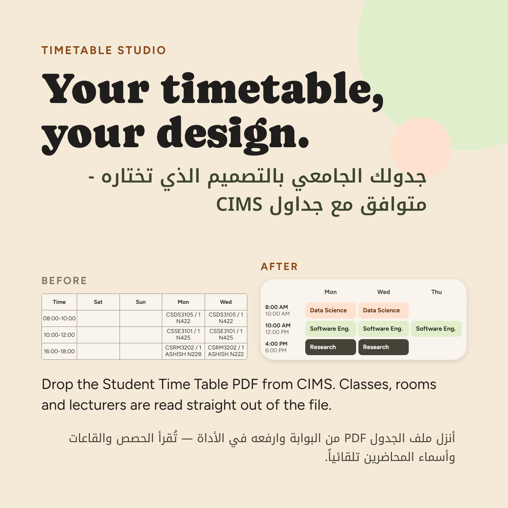
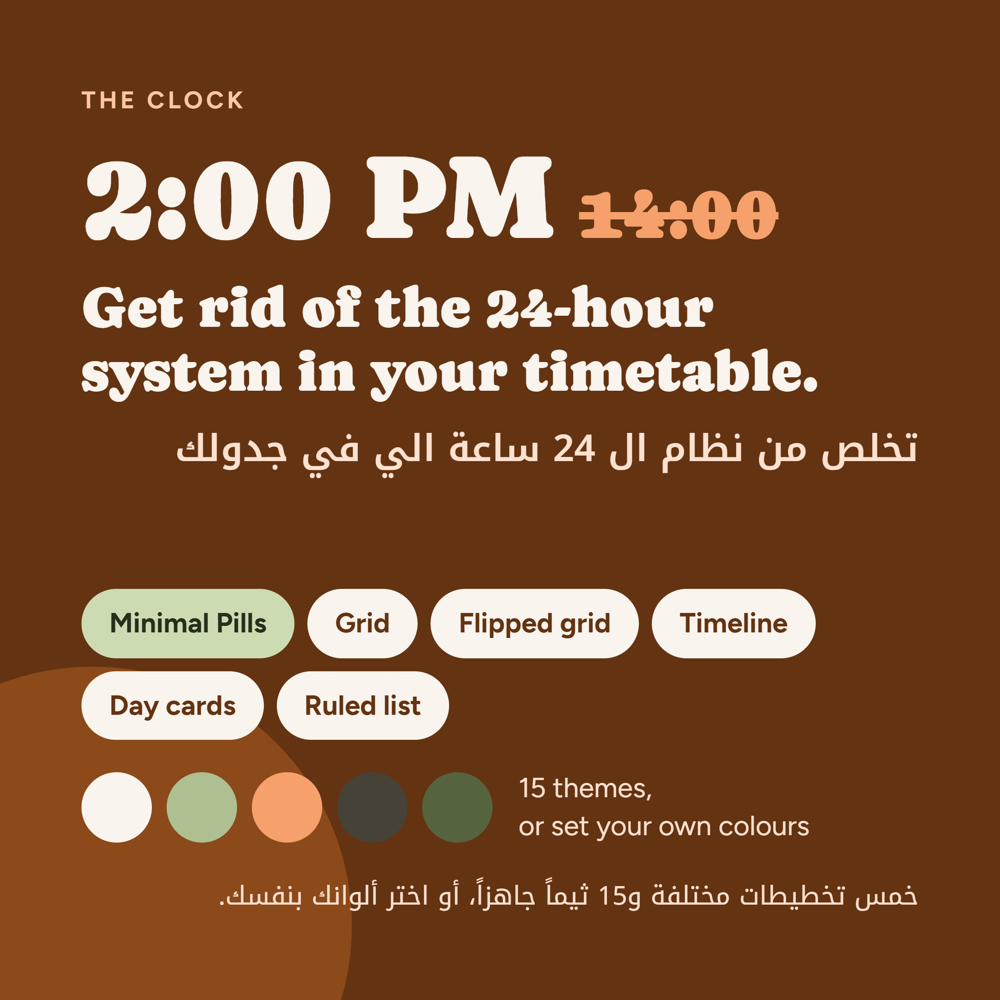
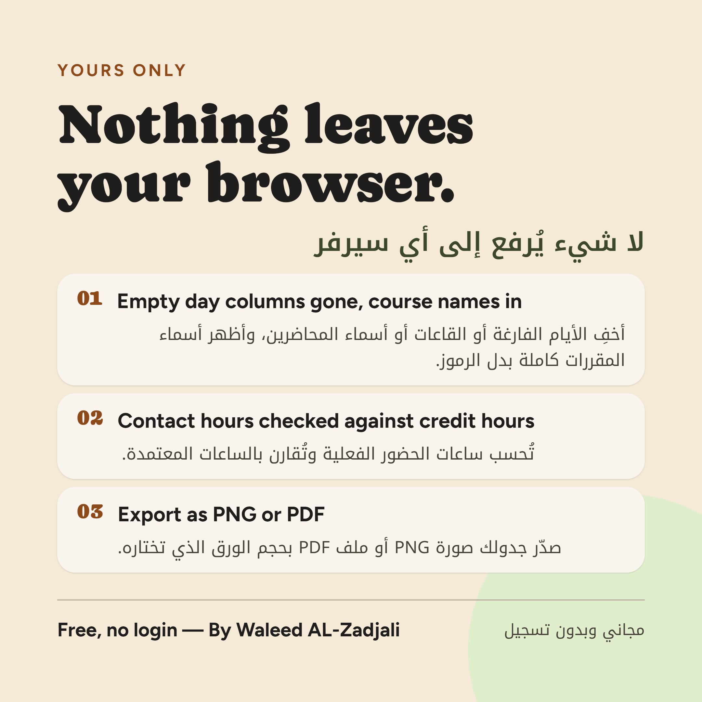
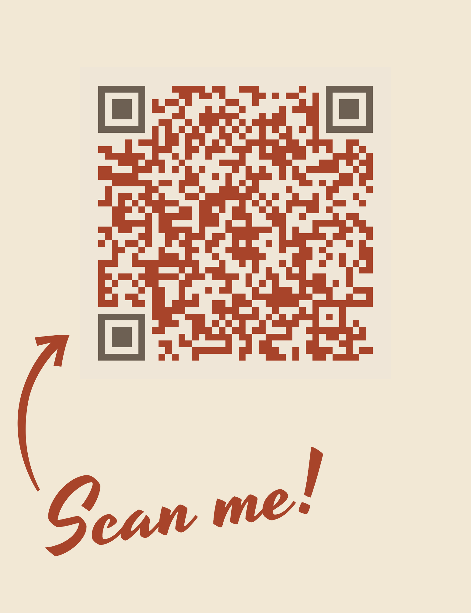

# Timetable-Studio

Download your Student Time Table PDF from the CIMS portal, drop it in, pick a layout and a theme, export it as a PNG or PDF. Everything runs in your browser — no upload, no account, nothing saved.

**[Open it here](https://zadjali04.github.io/Timetable-Studio/)** Version 1.0

> Note: This is a vibe coded tool.

## What it does

- Reads the CIMS Student Time Table PDF — classes, rooms, lecturers, course list
- 6 layouts and 16 themes, plus custom colours and a colour per course
- Contact hours counted from your real class times, not the fixed 3 credit hours
- Fix anything the PDF got wrong, or skip the PDF and type it in yourself
- Export as PNG or PDF

## Privacy

Your PDF never leaves your computer. It's read in the browser, the text is pulled out, and the file is dropped. Your timetable and settings live in the tab only and are wiped when you close it. No server, no database.

Visit counts come from Cloudflare Web Analytics — no cookies, no personal data.

## Running it yourself

Download `index.html` and open it — that's the whole app, one file. Needs internet on first load for pdf.js, html-to-image, jsPDF and the font.

## Share it

  

---

Built by Waleed Alzadjali
